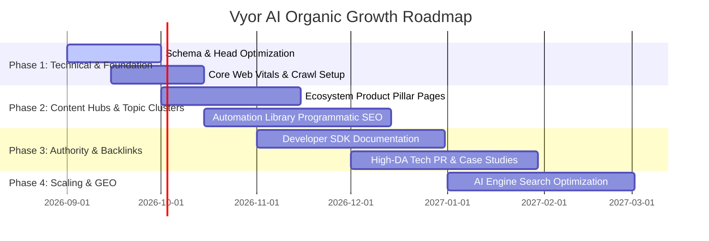

# 6-Month Comprehensive SEO Growth Strategy & Roadmap

---

## 📅 Roadmap Overview

---

## Phase 1: Foundation & Indexing (Months 1–2)
1. **Google Search Console & Bing Webmaster Verification**: Submit `sitemap.xml` and monitor indexation status.
2. **Schema Verification**: Validate `Organization`, `SoftwareApplication`, and `FAQPage` via Google Search Console Rich Results report.
3. **Canonical & Routing Audits**: Ensure all internal links point to canonical endpoints.

## Phase 2: Content Clusters & Product Landing Pages (Months 3–4)
1. **Infinity SDK Pillar Hub**: Deep technical teardowns, code walkthroughs, and benchmark comparisons against legacy microservice frameworks.
2. **Virtual Try-On Comparison Guide**: Create "AI Try-On vs Traditional 3D Rendering" and "Virtual Fitting for E-commerce" guides.
3. **Automation Library Expansion**: Index 50+ modular automation workflows with schema tags.

## Phase 3: Authority Building & Backlink Velocity (Months 4–5)
1. **Developer Ecosystem Marketing**: Publish integration tutorials on Dev.to, Hashnode, HackerNews, and ProductHunt.
2. **Partner Announcements**: Cross-link with partner ecosystem brands (Unify, Seekr, Inflect, Adhritverse Technologies, Upstep Solutions, Talentic Softwares, Trayatechnologies, Codearoma Tech).
3. **Technical Whitepapers**: Publish research on "Sub-15ms Neural Agent Inference at the Edge".

## Phase 4: GEO & Enterprise Conversion Optimization (Months 5–6)
1. **Passage-level Optimization**: Refine documentation for AI crawler summaries.
2. **Waitlist Conversion Optimization**: A/B test waitlist micro-copy and trust proof indicators.
3. **Monthly SEO Drift Monitoring**: Track keyword ranking trajectories, CTR, and search impressions.
